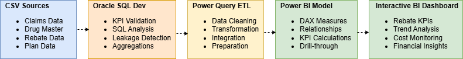
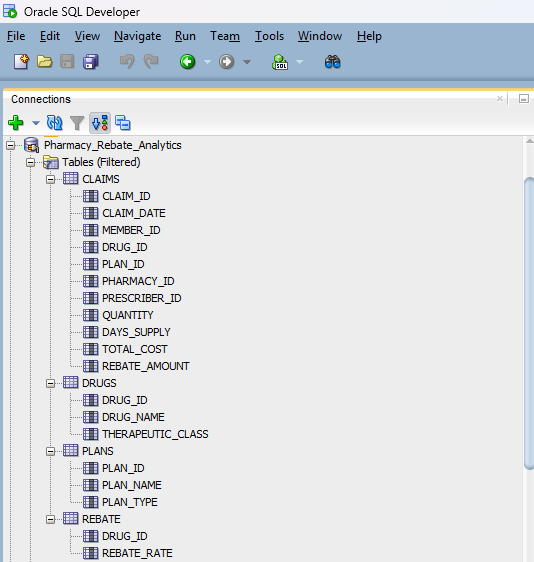
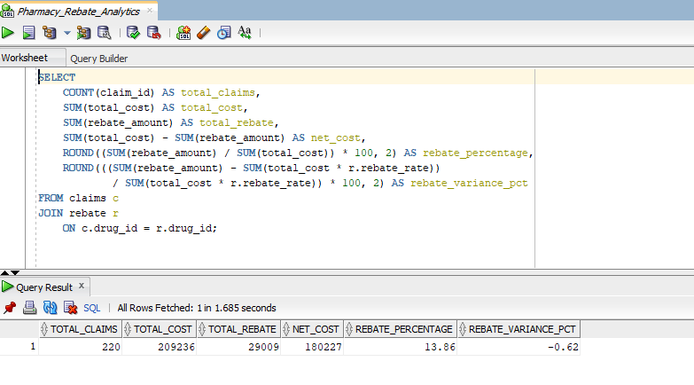
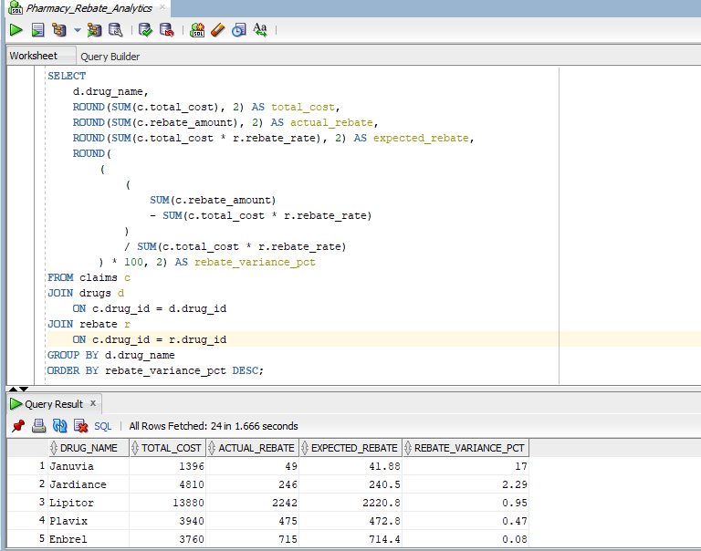
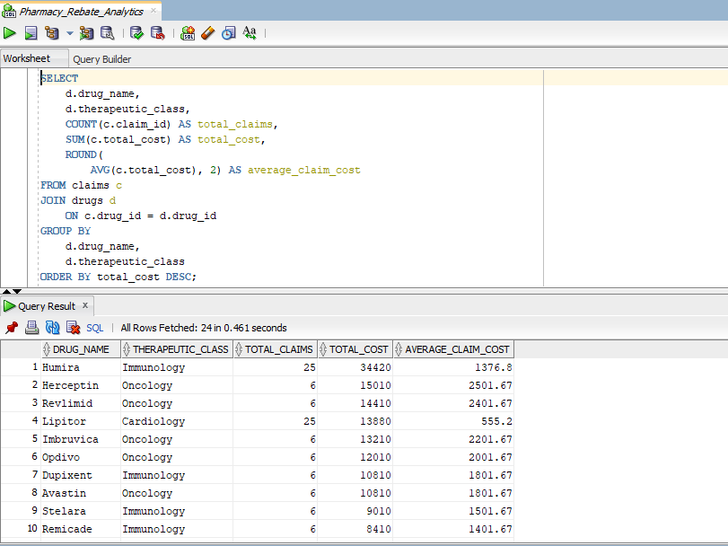
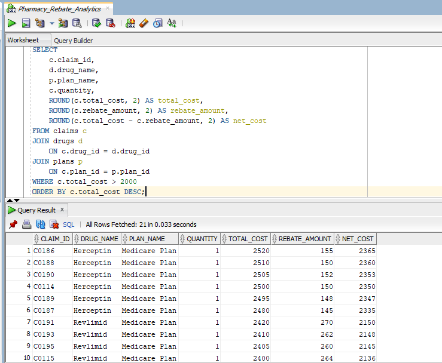

# Pharmacy Rebate Analytics Dashboard

## About This Project
This project demonstrates an end-to-end healthcare analytics solution using Oracle SQL and Power BI. It includes data processing, KPI validation, and interactive dashboard development for pharmacy rebate analysis.

## Project Overview
Developed an interactive Power BI dashboard to analyze pharmacy rebate performance, drug costs, claims trends, and therapeutic class insights. The solution is organized into three reporting layers:

  Rebate Overview: Executive summary of rebate KPIs, therapeutic distribution, and top-performing drugs.
  Rebate Analysis: Cost vs. rebate trends, variance analysis, and therapeutic class performance.
  Claim Details: Transaction-level claim reporting for detailed investigation and drill-through analysis.

## Business Problem
Pharmacy organizations need to track rebate performance, drug costs, and claims activity to identify high-cost drugs, rebate differences, and trends across therapeutic classes. Manual analysis of rebate data can be time-consuming and difficult to manage efficiently.

## Objectives
- Track pharmacy rebate performance
- Analyze total cost vs net cost
- Monitor rebate variance trends
- Identify top rebate-generating drugs
- Enable claim-level drill-through analysis
- Detect rebate leakage by comparing actual vs expected rebate amounts across drugs and therapeutic classes

## Dataset Description
The project uses simulated pharmacy and rebate datasets stored in CSV format to replicate real-world PBM and healthcare rebate analysis scenarios. The datasets were integrated and transformed in Power BI to support KPI reporting, variance analysis, and detailed claim analysis.
The dataset includes pharmacy claims across multiple therapeutic classes, drugs, and insurance plans for rebate performance and financial analysis.

**Datasets Included**
| Dataset                   | Description                                                                                                                 |
| ------------------------- | --------------------------------------------------------------------------------------------------------------------------- |
| Claims Data               | Contains claim-level transaction data including claim ID, drug ID, plan ID, quantity, total cost, and rebate amount         |
| Drugs Master Data         | Includes drug attributes such as drug name, drug ID, and therapeutic class                                                  |
| Rebate Data               | Contains rebate-related information including drug ID and rebate rate used to calculate expected rebate values              |
| Plans Information         | Stores payer and insurance plan details used for plan-level rebate and cost analysis                                        |

## Tools & Technologies
- Power BI
- Oracle SQL
- DAX Measures
- Power Query
- Data Modeling
- Data Visualization
- Excel / CSV Data Sources

## Solution Architecture
The following architecture illustrates the end-to-end analytics workflow used for pharmacy rebate analysis, from raw CSV ingestion and SQL validation to Power BI dashboard reporting.

## Data Model
Built a star-schema data model in Power BI with a central Claims fact table connected to Drug, Plan, Date, and Rebate dimensions.

## Data Workflow
- Imported pharmacy claims, drug, rebate, and plan datasets from CSV files into Oracle SQL Developer and Power BI.
- Performed SQL-based analysis including joins, aggregations, KPI validation, rebate variance calculations, and leakage detection.
- Used Power Query for data cleaning, transformation, and preparation for analysis.
- Designed a relational Power BI data model connecting claims, drugs, plans, and rebate tables.
- Developed DAX measures for KPIs including Rebate %, Net Cost, and Rebate Variance.
- Built interactive dashboards with slicers and drill-through capabilities.
  
## Key Features
- Interactive slicers and filters
- KPI tracking dashboard
- Trend analysis
- Drill-through claim details
- Rebate variance monitoring
- Multi-page dashboard navigation (Overview → Analysis → Details)

## Technical Highlights
- Power BI Dashboard Development & Visualization
- Data Modeling & Transformation using Power BI
- DAX Measures & KPI Development (Rebate %, Net Cost, Variance Analysis)
- SQL-based Analytical Processing for KPI validation and rebate analysis
- Drill-through analysis for detailed claim investigation
- Interactive dashboard design with slicers and conditional formatting

## KPIs
- Total Pharmacy Claims Processed
- Total Pharmacy Spend
- Total Rebate Recovery
- Net Drug Cost
- Rebate Efficiency %
- Rebate Variance %

## Business Insights
- Identified Immunology as the highest rebate-contributing therapeutic class across total claims and rebate recovery
- Detected rebate variance fluctuations where actual rebates fell below expected rebate thresholds, indicating potential rebate leakage
- Highlighted high-cost, high-rebate drugs contributing disproportionately to overall pharmacy spend
- Enabled claim-level analysis to support financial investigation and rebate performance monitoring

## Power BI Dashboard Screenshots

### 1. Rebate Overview – Default View
Provides a high-level summary of rebate performance, claim metrics, and cost distribution across all therapeutic classes.

### 2. Rebate Overview – Filtered by Therapeutic Class
Displays rebate trends, top drugs, and KPI changes after filtering by a selected therapeutic class.

### 3. Claim Details – Therapeutic Class Analysis
Shows claim-level transaction details and rebate performance for the selected therapeutic class.

### 4. Rebate Overview – Filtered by Drug Name
Displays rebate trends and KPI changes after selecting a specific drug.

### 5. Claim Details – Drug Name Analysis
Provides detailed claim-level insights, rebate values, and cost analysis for the selected drug.

## Backend SQL Analysis (Oracle SQL)
Oracle SQL was used for KPI validation, rebate variance analysis, and backend data processing before dashboard visualization in Power BI.

**SQL Scripts Included**
| Script | Purpose |
|------|--------|
| 01_top_rebate_drugs.sql | Identifies highest rebate-generating drugs |
| 02_rebate_leakage_analysis.sql | Detects potential rebate leakage between expected vs actual rebate |
| 03_plan_performance.sql | Analyzes cost and rebate performance by insurance plan |
| 04_therapeutic_class_analysis.sql | Evaluates rebate trends by therapeutic class |
| 05_monthly_rebate_trends.sql | Tracks monthly cost and rebate trends |
| 06_claims_summary.sql | Provides overall KPI summary (claims, cost, rebate, net cost) |
| 07_high_cost_drugs.sql | Identifies high-cost drugs and financial impact |
| 08_rebate_variance_by_drug.sql | Measures variance between expected and actual rebate |
| 09_high_cost_claims.sql | Identifies high-cost pharmacy claims and analyzes rebate-adjusted financial impact |

## Oracle SQL Screenshots

### 1. Database Schema

### 2. KPI Summary Query

### 3. Rebate Leakage Analysis

### 4. High Cost Drug Analysis

### 5. High Cost Claims Analysis

## SQL Skills Demonstrated
- SQL Joins & Multi-table Analysis
- Aggregations & Group By Analysis
- CASE-based Conditional Logic
- KPI Calculation using SQL
- Data Validation & Reconciliation

## Key Skills Demonstrated
- Power BI Dashboard Development
- Data Visualization
- Data Modeling & Transformation
- DAX Calculations & Measures
- Business Performance Analysis
- Interactive Dashboard Design
- Drill-through & Detail-Level Analytics

## Business Impact
- Enabled identification of rebate leakage through variance analysis between expected and actual rebates
- Improved visibility into pharmacy spend and rebate efficiency across therapeutic classes
- Reduced manual reporting effort by centralizing KPI tracking in an interactive Power BI dashboard
- Supported claim-level financial investigation through drill-through analytics
  

